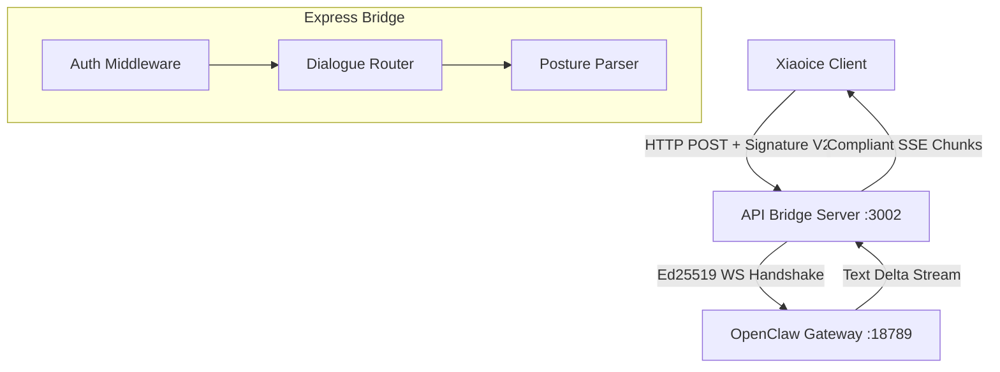

# 🚀 Xiaoice-to-OpenClaw API Bridge

A standalone, production-ready Express API bridge that connects any **Xiaoice Digital Human / Dialogue Client** with a local or remote **OpenClaw Gateway**.

The bridge intercepts, validates, and translates standard Xiaoice request signatures, opens a secure Ed25519-signed websocket stream with OpenClaw, parses postural gesture cues, and translates dialogue text into seamless, chunk-by-chunk Server-Sent Events (SSE) streams.

---

## ✨ Features

- 🔑 **Xiaoice Signature V2 Validation**: Enforces full cryptographic verification (SHA-512 over sorted keys) with 5-minute replay window validation to secure all incoming traffic.
- 🎭 **Silent Local Auto-Pairing**: Employs a dynamically generated **Ed25519** identity on boot and registers as a standard `"gateway-client"` backend to skip manual approval and connect instantly.
- 🏃‍♂️ **Postural Gesture Extraction**: Scans replies for brackets containing digital human skeletal animation commands (e.g. `[huishou]`) and converts them into the compliant `replyPayload.postureList` JSON array.
- 📡 **Full API Surface**: Fully supports `/api/talk` (streaming SSE), `/api/welcome` (welcome cue), `/api/goodbye` (session close), and `/api/recquestions` (dynamic recommendations).

---

## 🏗️ Project Architecture



---

## ⚙️ Configuration Setup

Copy `.env.example` to `.env` and configure your environmental variables:

```bash
cp .env.example .env
```

| Environment Variable | Default Value | Description |
| :--- | :---: | :--- |
| `PORT` | `3002` | Port on which the Bridge Server listens. |
| `XIAOICE_ACCESS_KEY` | `test_access_key` | Public access key credentials assigned to Xiaoice. |
| `XIAOICE_SECRET_KEY` | `test_secret_key` | Secret key used to sign incoming Xiaoice Signature V2 requests. |
| `OPENCLAW_WS_URL` | `ws://127.0.0.1:18789` | WebSocket URL of the target OpenClaw Gateway. |
| `OPENCLAW_TOKEN` | *your_token* | Authentication token defined in OpenClaw's `openclaw.json`. |
| `OPENCLAW_AGENT_ID` | `main` | Default fallback agent routing tag. |

---

## 🚀 Running the Project

You can run the project directly on your host machine or deployment environment using Node.js or Docker.

### Method A: Native Execution (Node.js)

1. **Install dependencies**:
   ```bash
   npm install
   ```
2. **Launch development environment**:
   ```bash
   npm run dev
   ```
3. **Compile and run production server**:
   ```bash
   npm run build
   npm start
   ```

*(Alternatively, use the convenience helper script: `./run.sh`)*

---

### Method B: Containerized Execution (Docker)

1. **Build and start the container via Docker Compose**:
   ```bash
   docker compose up --build -d
   ```
2. **Check live container logs**:
   ```bash
   docker compose logs -f
   ```

*Note: In container environments, `host.docker.internal` is mapped to your host machine's loopback interface so the container can reach OpenClaw on port `18789` seamlessly.*

---

## 📡 API Routing Specifications

All requests (except `/health`) **require** authentic **Xiaoice Signature V2** headers:
- `X-Key`: Access Key ID
- `X-Timestamp`: Unix millisecond timestamp
- `X-Sign`: SHA-512 V2 digest (`bodyString={JSON}&secretKey={SK}&timestamp={TS}`)

### 1. Core Streaming Dialogue `/api/talk`
Receives text prompt requests and pipes back word-by-word streaming Server-Sent Events (SSE).
- **Method**: `POST`
- **Request Body**:
  ```json
  {
    "askText": "你好，我叫小明。",
    "sessionId": "session-12345",
    "traceId": "trace-9999",
    "languageCode": "zh",
    "userParams": "main"
  }
  ```
- **Response Format**: Chunks of `data: { ...JSON... }\n\n` ending with `isFinal: true`.

### 2. Digital Human Greetings `/api/welcome`
Triggered when a user initiates a session, delivering localized welcome text and initial greeting gestures.
- **Method**: `POST`
- **Response Payload**:
  ```json
  {
    "id": "trace-welcome",
    "replyText": "你好！我是智能助手。很高兴为你服务！",
    "replyPayload": {
      "postureList": "[\"huishou\"]",
      "loopPosture": "true"
    },
    "sessionId": "session-123",
    "isFinal": true
  }
  ```

### 3. Session Goodbye `/api/goodbye`
Triggered upon closing the conversation container.
- **Method**: `POST`

### 4. Dynamic Recommended Actions `/api/recquestions`
Provides automated suggested cues for the user interface.
- **Method**: `POST`

---

## 🧪 Testing and Verification

The repository contains two dedicated validation files. Ensure the bridge server is active on port `3002` before running:

### 1. Integration Verification Suite
Exercises all endpoint surfaces and prints clean assertions:
```bash
npx tsx test.ts
```

### 2. Multi-Turn Session Memory Simulation
Demonstrates full conversation state preservation, ensuring that your OpenClaw LLM agent accurately remembers details across chat turns:
```bash
npx tsx chat.ts
```

---

## 📡 Accessing the Bridge from Other Computers

If you are calling this Bridge from other devices on your local network (LAN):

1. **Find your Host IP**:
   ```bash
   ip route get 1.1.1.1 | awk '{print $7}'
   # E.g., 192.168.1.100
   ```
2. **Clear the Firewall**:
   Open port `3002` for incoming TCP traffic:
   ```bash
   sudo ufw allow 3002/tcp
   ```
3. **Trigger the API**:
   Target your calls to `http://192.168.1.100:3002/api/talk`.
